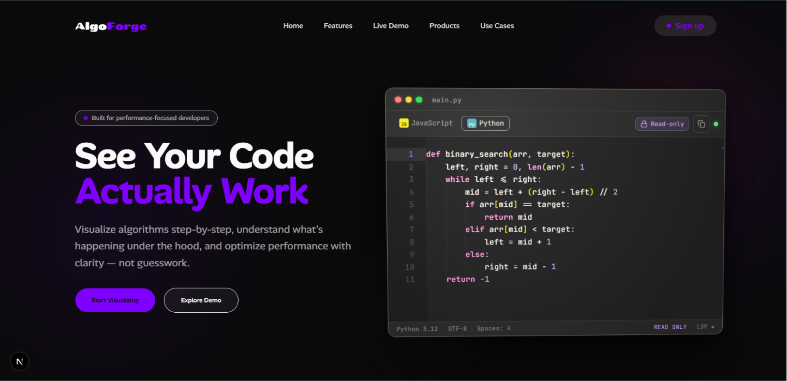
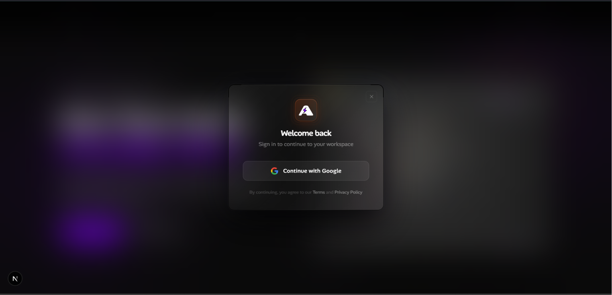
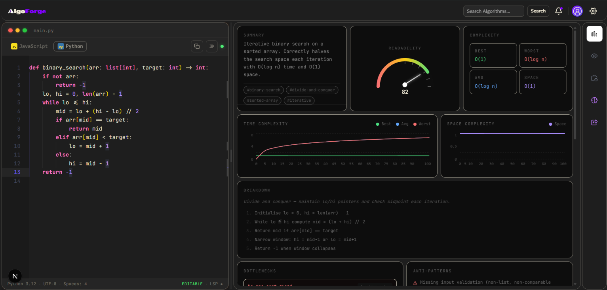
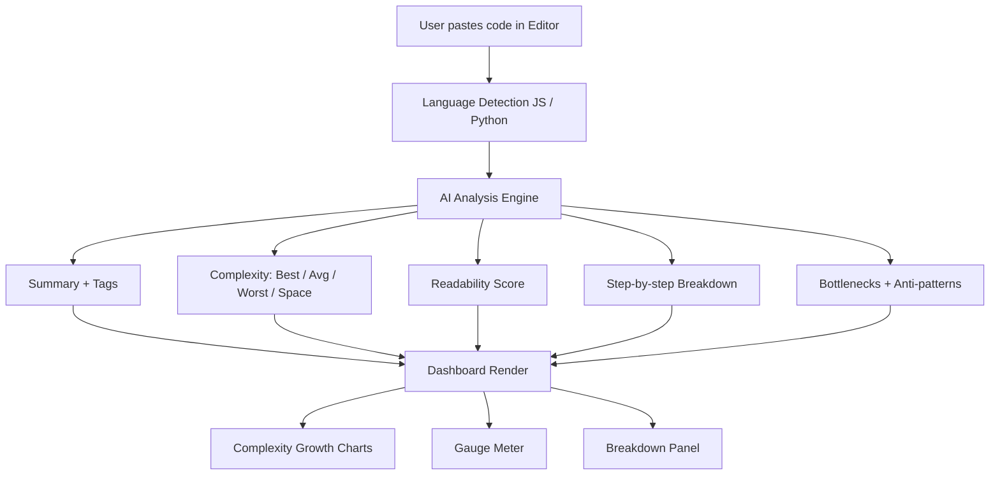
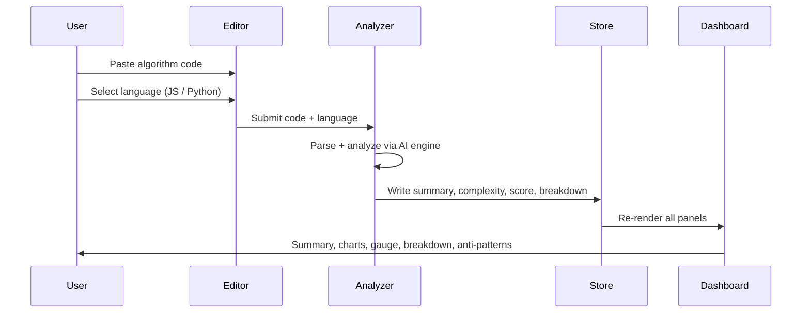

# AlgoForge

> Visualize algorithms step-by-step, understand what's happening under the hood, and optimize performance with clarity — not guesswork.


---

## Screenshots

**Landing Page**



**Google OAuth — Sign In**



**Algorithm Analyzer — Binary Search**



---

## What is AlgoForge?

AlgoForge is an algorithm analysis and visualization platform. Paste or write code in the editor, and AlgoForge gives you:

- A plain-English **summary** of what the algorithm does
- A **readability score** (0–100 gauge)
- **Best / Worst / Average / Space complexity** breakdown
- **Time and space complexity charts** rendered as growth curves
- A step-by-step **breakdown** of the algorithm's logic
- Detected **bottlenecks** and **anti-patterns**

Supports JavaScript and Python. Auth via Google OAuth 2.0.

---

## Architecture



---

## Feature Breakdown

### Code Editor
- Monaco-based editor with syntax highlighting
- Supports JavaScript and Python
- Editable and read-only modes
- LSP-style status bar (language, encoding, spaces)

### AI Algorithm Analyzer
- Generates a plain-English summary of the algorithm
- Tags the algorithm (`#binary-search`, `#divide-and-conquer`, `#iterative`, etc.)
- Outputs complexity in four dimensions: Best, Worst, Average, Space

### Complexity Visualizer
- Plots Best / Average / Worst time complexity as growth curves (O(1), O(log n), O(n), O(n²), etc.)
- Separate space complexity chart
- Custom-built chart renderer — no Chart.js dependency

### Readability Gauge
- Scores code readability 0–100 using a dial/gauge meter
- Score is derived from variable naming, nesting depth, control flow clarity

### Step-by-step Breakdown
- Decomposes the algorithm into numbered logical steps
- Highlights the core invariant / loop condition in italics
- Shows bottlenecks (e.g. "No pre-sort guard") and anti-patterns with warning indicators

### Google OAuth 2.0
- Sign-in modal with Google provider
- Session-based workspace persistence

---

## Tech Stack

| Layer | Tech |
|---|---|
| Framework | Next.js 15 (App Router) |
| Language | TypeScript |
| State Management | Zustand + Immer |
| Animation | GSAP |
| Styling | Tailwind CSS |
| Auth | Google OAuth 2.0 |
| Editor | Monaco Editor |

---

## Analysis Flow



---

## Project Structure

```
algoforge/
├── app/
│   ├── page.tsx                  # Landing page
│   ├── dashboard/
│   │   └── page.tsx              # Main analyzer workspace
│   └── layout.tsx
├── components/
│   ├── editor/
│   │   └── CodeEditor.tsx        # Monaco editor wrapper
│   ├── analyzer/
│   │   ├── SummaryPanel.tsx      # Summary + tags
│   │   ├── ComplexityPanel.tsx   # Best/Worst/Avg/Space cards
│   │   ├── ReadabilityGauge.tsx  # Dial gauge component
│   │   ├── TimeComplexityChart.tsx
│   │   ├── SpaceComplexityChart.tsx
│   │   ├── BreakdownPanel.tsx    # Step-by-step logic
│   │   ├── BottlenecksPanel.tsx
│   │   └── AntiPatternsPanel.tsx
│   └── auth/
│       └── SignInModal.tsx        # Google OAuth modal
├── store/
│   └── analyzerStore.ts           # Zustand + Immer store
├── lib/
│   └── analyzeCode.ts             # AI analysis orchestration
└── images/
    ├── Screenshot_2026-06-18_031407.png
    ├── Screenshot_2026-06-18_031347.png
    └── Screenshot_2026-06-18_031314.png
```

---

## Running Locally

```bash
git clone https://github.com/raunakyadav/algoforge
cd algoforge
npm install
npm run dev
```

Open [http://localhost:3000](http://localhost:3000).

Set up environment variables:

```env
GOOGLE_CLIENT_ID=your_google_client_id
GOOGLE_CLIENT_SECRET=your_google_client_secret
NEXTAUTH_SECRET=your_nextauth_secret
NEXTAUTH_URL=http://localhost:3000
```

---

## Roadmap

- [ ] Binary Search Tree animator with step-by-step traversal
- [ ] Graph BFS / DFS visualizer
- [ ] Side-by-side algorithm comparison mode
- [ ] Export analysis report as PDF
- [ ] User history — save and revisit past analyses

---

## Author

**Raunak Yadav** — Full-Stack & DevOps Engineer  
[GitHub](https://github.com/raunakyadav) · [Portfolio](https://raunakyadav.dev) · [LinkedIn](https://linkedin.com/in/raunakyadav)